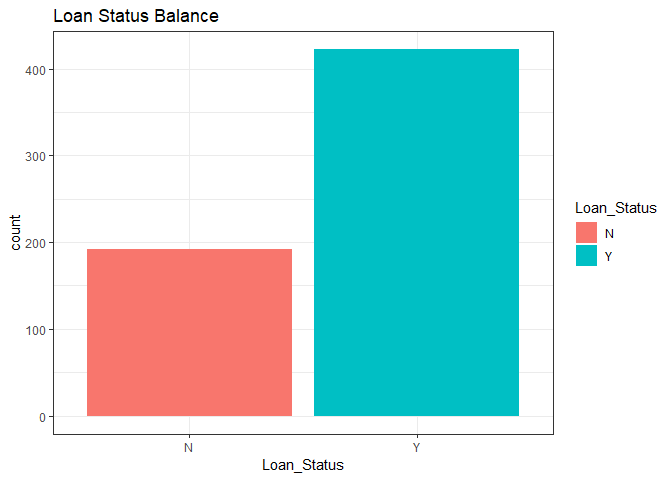
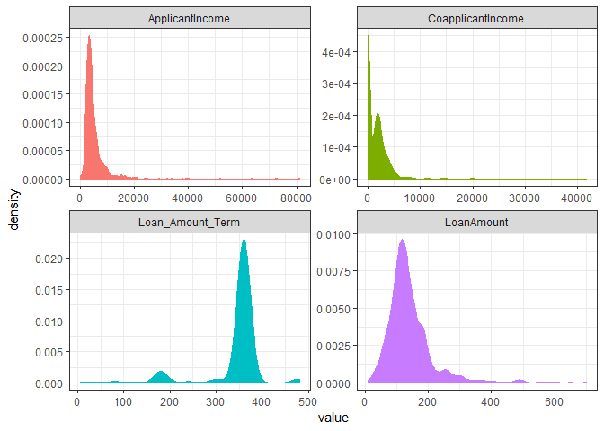
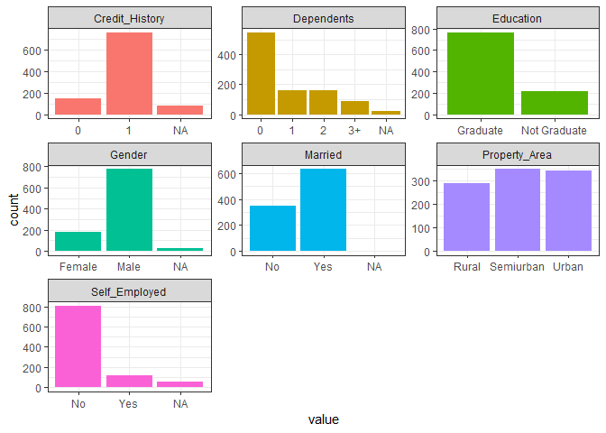
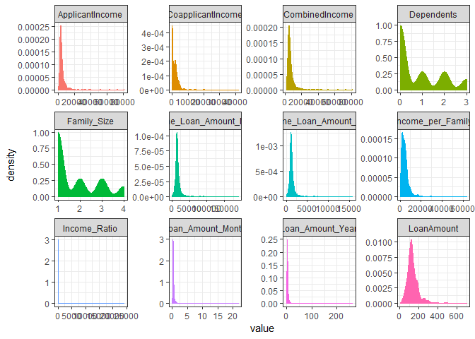

Loan Predictions Markdown
================

First, load the necessary libraries and read in the data.

Load Data
---------

``` r
library(tidyverse)
library(caret)
library(caretEnsemble)
library(recipes)
library(kableExtra)

set.seed(865)
setwd('C:/Users/Ryan/Desktop/Data Science/Analytics Vidhya Competitions/Loan Prediction Problem III/')

# Training Data
train <- read_csv("train.csv",
                  col_types = cols(Credit_History = col_character()))

# Testing Data
test <- read_csv("test.csv",
                 col_types = cols(Credit_History = col_character()))

my_kable <- function(x, max.rows=6, ...) {
  kable(x[1:max.rows, ], ...)
}
```

What's the data look like?

    ## Observations: 614
    ## Variables: 13
    ## $ Loan_ID           <chr> "LP001002", "LP001003", "LP001005", "LP00100...
    ## $ Gender            <chr> "Male", "Male", "Male", "Male", "Male", "Mal...
    ## $ Married           <chr> "No", "Yes", "Yes", "Yes", "No", "Yes", "Yes...
    ## $ Dependents        <chr> "0", "1", "0", "0", "0", "2", "0", "3+", "2"...
    ## $ Education         <chr> "Graduate", "Graduate", "Graduate", "Not Gra...
    ## $ Self_Employed     <chr> "No", "No", "Yes", "No", "No", "Yes", "No", ...
    ## $ ApplicantIncome   <dbl> 5849, 4583, 3000, 2583, 6000, 5417, 2333, 30...
    ## $ CoapplicantIncome <dbl> 0, 1508, 0, 2358, 0, 4196, 1516, 2504, 1526,...
    ## $ LoanAmount        <dbl> NA, 128, 66, 120, 141, 267, 95, 158, 168, 34...
    ## $ Loan_Amount_Term  <dbl> 360, 360, 360, 360, 360, 360, 360, 360, 360,...
    ## $ Credit_History    <chr> "1", "1", "1", "1", "1", "1", "1", "0", "1",...
    ## $ Property_Area     <chr> "Urban", "Rural", "Urban", "Urban", "Urban",...
    ## $ Loan_Status       <chr> "Y", "N", "Y", "Y", "Y", "Y", "Y", "N", "Y",...

    ## Observations: 367
    ## Variables: 12
    ## $ Loan_ID           <chr> "LP001015", "LP001022", "LP001031", "LP00103...
    ## $ Gender            <chr> "Male", "Male", "Male", "Male", "Male", "Mal...
    ## $ Married           <chr> "Yes", "Yes", "Yes", "Yes", "No", "Yes", "No...
    ## $ Dependents        <chr> "0", "1", "2", "2", "0", "0", "1", "2", "2",...
    ## $ Education         <chr> "Graduate", "Graduate", "Graduate", "Graduat...
    ## $ Self_Employed     <chr> "No", "No", "No", "No", "No", "Yes", "No", "...
    ## $ ApplicantIncome   <dbl> 5720, 3076, 5000, 2340, 3276, 2165, 2226, 38...
    ## $ CoapplicantIncome <dbl> 0, 1500, 1800, 2546, 0, 3422, 0, 0, 0, 2400,...
    ## $ LoanAmount        <dbl> 110, 126, 208, 100, 78, 152, 59, 147, 280, 1...
    ## $ Loan_Amount_Term  <dbl> 360, 360, 360, 360, 360, 360, 360, 360, 240,...
    ## $ Credit_History    <chr> "1", "1", "1", NA, "1", "1", "1", "0", "1", ...
    ## $ Property_Area     <chr> "Urban", "Urban", "Urban", "Urban", "Urban",...

The training set has 614 rows and 13 varibles. The test set has 367 rows and 12 variables. Now, store the test set Loan ID's, and combine the data sets for exploration and transformation.

``` r
# Store Test Set IDs
test_ids <- test$Loan_ID

# Remove ID Variables
train$Loan_ID <- NULL
test$Loan_ID <- NULL

# Combine Training and Testing
train$train_test <- 'train'
test$train_test <- 'test'
dat <- bind_rows(train, test)
```

Exploratory Data Analysis -- Data Distributions
-----------------------------------------------

#### Missing Values by Variable

    ##            Gender           Married        Dependents         Education 
    ##                24                 3                25                 0 
    ##     Self_Employed   ApplicantIncome CoapplicantIncome        LoanAmount 
    ##                55                 0                 0                27 
    ##  Loan_Amount_Term    Credit_History     Property_Area       Loan_Status 
    ##                20                79                 0               367 
    ##        train_test 
    ##                 0



The dependent variable is slightly imbalanced, but should not be an issue.

#### Numeric Variable Distributions

 Both incomes and Loan Amount are skewed to the right. Loan Amount Term seems to have two major groups.

#### Categorical Variable Distributions



Exploratory Data Analysis -- Missing Values
-------------------------------------------

``` r
# Function to calculate mode
getmode <- function(v) {
  uniqv <- unique(v)
  uniqv[which.max(tabulate(match(v, uniqv)))]
}

dat_no_missings <- dat %>% 
  # Replace missing Loan Amount with median
  mutate(LoanAmount = ifelse(is.na(LoanAmount), median(LoanAmount, na.rm = TRUE), LoanAmount)) %>% 
  # Replace missing Loan Amount Term according to Loan Amount
  mutate(Loan_Amount_Term = ifelse((is.na(Loan_Amount_Term) & LoanAmount >= 144), 360,
                                   ifelse((is.na(Loan_Amount_Term) & LoanAmount < 144), 180,
                                          Loan_Amount_Term)
                                   )
         ) %>% 
  # Replacing missing Gender with Male
  mutate(Gender = ifelse(is.na(Gender), 'Male', Gender)) %>% 
  # Replace missing Married with Yes
  mutate(Married = ifelse(is.na(Married), 'Yes', Married)) %>% 
  # Replace missing Dependents with 0
  mutate(Dependents = ifelse(is.na(Dependents), '0', Dependents)) %>% 
  # Replace missing Self employed with mode
  mutate(Self_Employed = ifelse(is.na(Self_Employed), getmode(Self_Employed), Self_Employed)) %>% 
  # Replace missing Credit History with mode
  mutate(Credit_History = ifelse(is.na(Credit_History), getmode(Credit_History), Credit_History))

# Check for missing values
colSums(is.na(dat_no_missings[, 1:11]))
```

    ##            Gender           Married        Dependents         Education 
    ##                 0                 0                 0                 0 
    ##     Self_Employed   ApplicantIncome CoapplicantIncome        LoanAmount 
    ##                 0                 0                 0                 0 
    ##  Loan_Amount_Term    Credit_History     Property_Area 
    ##                 0                 0                 0

Feature Engineering
-------------------

``` r
dat_trans <- dat_no_missings %>% 
  # Combine Incomes
  mutate(CombinedIncome = ApplicantIncome + CoapplicantIncome) %>% 
  # Ratio of Incomes
  mutate(Income_Ratio = (CoapplicantIncome + 1)/(ApplicantIncome+ 1)) %>% 
  # Has Coapplicant
  mutate(Coapplicant = as.factor(ifelse(CoapplicantIncome == 0, 1, 0))) %>% 
  # Loan Amount Term in Years
  mutate(Loan_Amount_Term_Year = Loan_Amount_Term/12) %>% 
  # Loan Amount per Year
  mutate(Loan_Amount_Year = LoanAmount/Loan_Amount_Term_Year) %>% 
  # Loan Amount per Month
  mutate(Loan_Amount_Month = LoanAmount/Loan_Amount_Term) %>% 
  # Income to Loan Amount per Year
  mutate(Income_Loan_Amount_Year = CombinedIncome/Loan_Amount_Year) %>% 
  # Income to Loan Amount per Month
  mutate(Income_Loan_Amount_Month = CombinedIncome/Loan_Amount_Month) %>% 
  # Married with Kids
  mutate(Married_and_Dependents = as.factor(ifelse(Married == 'Yes' & Dependents != '0', 1, 0))) %>% 
  # Change Dependents to Numeric
  mutate(Dependents = as.numeric(recode(Dependents, '3+' = '3'))) %>%
  # Family Size
  mutate(Family_Size = ifelse(Married == "Y", Dependents + 2, Dependents + 1)) %>% 
  # Income per Family Member
  mutate(Income_per_Family = CombinedIncome/Family_Size) %>% 
  # Bins for Loan Term
  mutate(Loan_Amount_Term_Year = ifelse(Loan_Amount_Term_Year < 20, 'Less than 20',
                                        ifelse(Loan_Amount_Term_Year >= 20 & Loan_Amount_Term_Year < 30, '20 to 30',
                                               '30+')
                                        )
         ) %>% 
  select(-Loan_Amount_Term)
```

#### Check new numeric variables

 Again, these variables are skewed to the right.

Prep Data for Modeling
----------------------

``` r
# Resplit Data
train_trans <- dat_trans %>% filter(train_test == 'train') %>% select(-train_test)
test_trans <- dat_trans %>% filter(train_test == 'test') %>% select(-train_test)

rec_obj <- recipe(Loan_Status ~ ., data = train_trans) %>%
  # Sqrt Skewed Numeric Variables
  step_sqrt(all_numeric(), -Dependents, -Family_Size) %>% 
  # One Hot Encoding
  step_dummy(all_nominal(), -all_outcomes()) %>% 
  # Normalize
  step_center(all_predictors(), -all_outcomes()) %>% 
  step_scale(all_predictors(), -all_outcomes()) %>% 
  prep(data = train_trans)

X_train <- bake(rec_obj, newdata = train_trans)
X_test <- bake(rec_obj, newdata = test_trans)

Y_train <- X_train$Loan_Status
X_train$Loan_Status <- NULL
X_test$Loan_Status <- NULL
```

Modeling
--------

``` r
# Cross Validation Control
cvControl <- trainControl(
  method = 'cv', #cross validation
  number = 5, #5-fold,
  savePredictions = 'final',
  classProbs = TRUE
)

# Logistic Regression
mod_glm <- train(x = X_train,
                 y = Y_train,
                 method = 'glm',
                 trControl = cvControl)

# K-Nearest Neighbors
mod_knn <- train(x = X_train,
                 y = Y_train,
                 method = 'knn',
                 trControl = cvControl,
                 tuneLength = 20)

# Random Forest
mod_rf <- train(x = X_train,
                y = Y_train,
                method = 'rf',
                trControl = cvControl,
                tuneLength = 10)
```

Which model did the best?
-------------------------

Logistic Regression:

    ## [1] 0.7932027

K-Nearest Neighbors:

    ## [1] 0.7671465

Random Forest:

    ## [1] 0.7867195

Logistic Regression achieved the highest cross-validation accuracy, so the final predictions will be made with this model.

``` r
pred_glm <- predict(mod_glm, X_test)

submission_glm <- data_frame(Loan_ID = test_ids, Loan_Status = pred_glm)
write.csv(submission_glm, 'Loan_Prediction_glm_submission.csv', row.names = FALSE)
```
